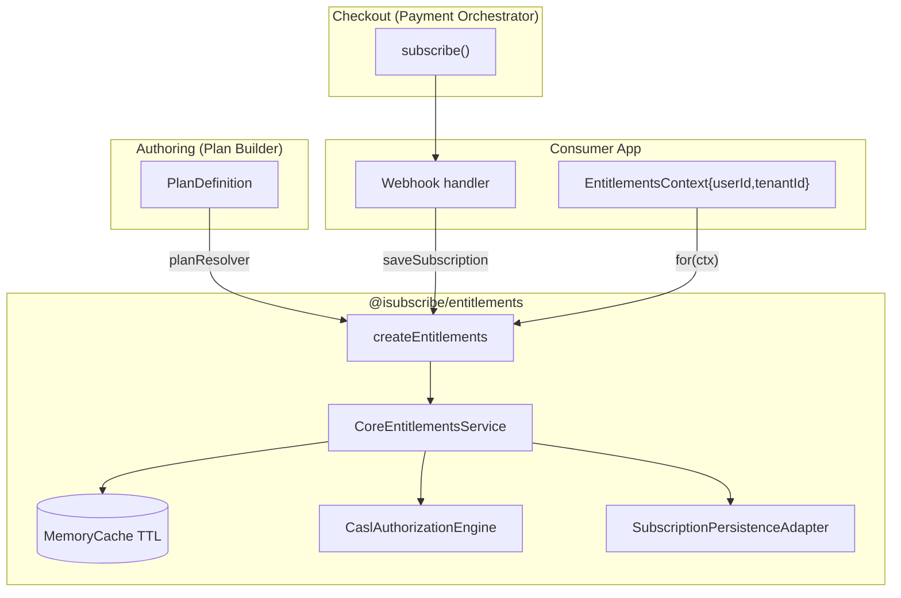
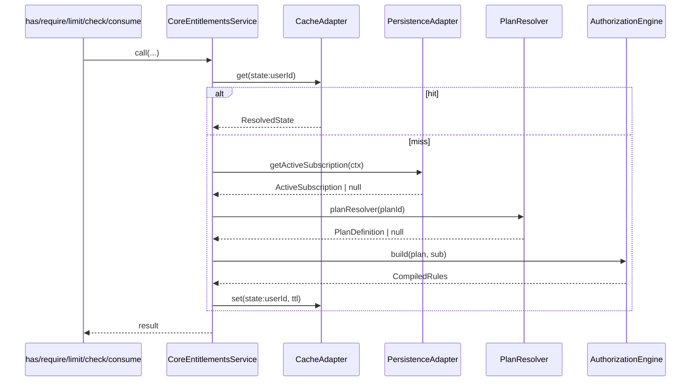

# Architecture — `@isubscribe/entitlements`

This document describes the internal moving parts of the package, the contracts
between them, and the recommended data shapes for each persistence adapter.
Consumers only need [`README.md`](./README.md); this is the engineering reference.

## 1. Big picture



## 2. Module graph

```
src/
├── index.ts                        public barrel for `.`
├── core/
│   ├── types.ts                    domain types (PlanDefinition, ActiveSubscription, ...)
│   ├── errors.ts                   typed error hierarchy
│   ├── cache.ts                    CacheAdapter + MemoryCache
│   ├── entitlements-service.ts     CoreEntitlementsService (per-context)
│   └── create-entitlements.ts      createEntitlements() factory
├── adapters/
│   ├── authorization/
│   │   ├── interface.ts            AuthorizationEngine + CompiledRules
│   │   └── casl-engine.ts          default CASL-backed engine
│   └── persistence/
│       ├── interface.ts            SubscriptionPersistenceAdapter
│       ├── memory.ts               in-memory (dev/tests)
│       ├── prisma.ts               Prisma client adapter
│       ├── supabase.ts             Supabase JS adapter
│       └── typeorm.ts              TypeORM DataSource adapter
├── react/
│   ├── index.ts                    public barrel for `/react`
│   ├── context.ts                  React context + snapshot type
│   ├── provider.tsx                EntitlementsProvider (SSR-aware)
│   ├── feature.tsx                 <Feature>
│   ├── locked-feature.tsx          <LockedFeature>
│   └── hooks/{use-subscription,use-feature,use-limit,use-usage}.ts
├── nest/
│   ├── index.ts                    public barrel for `/nest`
│   ├── tokens.ts                   DI tokens
│   ├── entitlements.module.ts      EntitlementsModule.forRoot/forRootAsync
│   ├── entitlements.guard.ts       EntitlementsGuard (global by default)
│   ├── consume-on-success.interceptor.ts
│   ├── require-subscription.decorator.ts
│   └── entitlements-context.ts     EntitlementsContextResolver (default + override)
└── validation/schemas.ts           zod parsers for ActiveSubscription / PlanDefinition
```

## 3. Engine internals (`CoreEntitlementsService`)

Each call goes through `resolve()`:



- `consume()` performs the limit check, calls `incrementUsage()` (atomic in
  every shipped adapter), then deletes the cached state so the next `usage()`
  call sees fresh data.
- `saveSubscription()` is exposed on the top-level `Entitlements` handle; it
  delegates to the adapter and invalidates the per-context cache.
- `getSubscription()` throws `NoActiveSubscriptionError` (HTTP 402) when no
  record exists. `has()`/`limit()` simply return `false`/`null`.

## 4. Status semantics

Only `trialing` and `active` grant entitlements:

```ts
ACTIVE_STATUSES = ['trialing', 'active'];
```

For `past_due`, `canceled`, or `expired` subscriptions, the engine compiles an
empty rule set. Consumers can layer a `fallbackPlan` (e.g. the free tier) so
those users don't get a hard wall — they just drop down to the free feature
map.

## 5. Authorization mapping (CASL → entitlements)

`CaslAuthorizationEngine` is the **only place** in the codebase that imports
`@casl/ability`. The mapping is intentionally narrow:

| Plan feature value | CASL rule                | Public surface                             |
| ------------------ | ------------------------ | ------------------------------------------ |
| `boolean true`     | `can('access', feature)` | `has` → true, `limit` → `undefined`        |
| `boolean false`    | (no rule)                | `has` → false                              |
| `number > 0`       | `can('access', feature)` | `has` → true, `limit` → number             |
| `number === 0`     | (no rule)                | `has` → false                              |
| `null`             | `can('access', feature)` | `has` → true, `limit` → `null` (unlimited) |
| undeclared         | (no rule)                | `has` → false, `limit` → `undefined`       |

`CompiledRules` is the only thing the service touches; swapping in OPA, Cerbos,
or a hand-rolled evaluator is a one-class change with **zero** consumer impact.

## 6. Persistence adapter contract

```ts
type SubscriptionPersistenceAdapter = {
  getActiveSubscription(ctx): Promise<ActiveSubscription | null>;
  saveSubscription(sub): Promise<void>;
  getUsage(ctx, metric): Promise<number>;
  incrementUsage(ctx, metric, amount): Promise<void>;
  resetUsage?(ctx, metric): Promise<void>;
};
```

Every shipped adapter scopes the usage counter by `currentPeriodStart` so
counters reset automatically when a billing period rolls over (or you call
`resetUsage()` from a cron job for explicit control).

### 6.1 Prisma — recommended schema

```prisma
model EntitlementsSubscription {
  id                     String   @id @default(cuid())
  userId                 String
  tenantId               String?
  planId                 String
  status                 String
  provider               String
  providerCustomerId     String?
  providerSubscriptionId String?
  startedAt              DateTime
  currentPeriodStart     DateTime
  currentPeriodEnd       DateTime
  entitlements           Json
  @@unique([userId, tenantId])
}

model EntitlementsUsage {
  id          String   @id @default(cuid())
  userId      String
  tenantId    String?
  metric      String
  periodStart DateTime
  amount      Int      @default(0)
  @@unique([userId, tenantId, metric, periodStart])
}
```

Atomic increment uses Prisma's `update { increment }` semantics, wrapped in an
`upsert` so the row is created on the first call.

### 6.2 Supabase — SQL migration

```sql
create table if not exists entitlements_subscriptions (
  id uuid primary key default gen_random_uuid(),
  user_id text not null,
  tenant_id text,
  plan_id text not null,
  status text not null,
  provider text not null,
  provider_customer_id text,
  provider_subscription_id text,
  started_at timestamptz not null,
  current_period_start timestamptz not null,
  current_period_end timestamptz not null,
  entitlements jsonb not null default '{}'::jsonb,
  unique (user_id, tenant_id)
);

create table if not exists entitlements_usage (
  id uuid primary key default gen_random_uuid(),
  user_id text not null,
  tenant_id text,
  metric text not null,
  period_start timestamptz not null,
  amount integer not null default 0,
  unique (user_id, tenant_id, metric, period_start)
);

create or replace function entitlements_increment_usage(
  p_user_id text,
  p_tenant_id text,
  p_metric text,
  p_period_start timestamptz,
  p_amount int
) returns void as $$
  insert into entitlements_usage (user_id, tenant_id, metric, period_start, amount)
  values (p_user_id, p_tenant_id, p_metric, p_period_start, p_amount)
  on conflict (user_id, tenant_id, metric, period_start)
  do update set amount = entitlements_usage.amount + excluded.amount;
$$ language sql;
```

The adapter calls the RPC for atomic upsert+increment; everything else is
plain `select`/`upsert`. RLS-friendly: filter by `user_id = auth.uid()`.

### 6.3 TypeORM

Either provide your own entities (whose columns match the structural type in
[`typeorm.ts`](./packages/entitlements/src/adapters/persistence/typeorm.ts))
or build them from the same fields as the Prisma schema above. Increment
uses `Repository.increment()` which compiles to a single SQL `UPDATE ... SET
amount = amount + ?` statement.

### 6.4 Memory

`Map`-backed; not multi-process safe. Use for tests, demos, and CI.

## 7. Cache

Default `MemoryCache` is a process-local TTL store keyed by
`state:<tenant?>:<userId>`. Override `EntitlementsConfig.cache` with a Redis
adapter for multi-instance setups. Set `cacheTtlMs: 0` to disable caching.

The cache holds the **resolved state** (subscription + plan + compiled rules),
not raw rows; the engine never has to compile twice within a window.

## 8. Multi-tenant guidance

Every `EntitlementsContext` carries an optional `tenantId`. All shipped adapters
include it in their composite keys. The Nest context resolver pulls it from
`req.user.tenantId` or the `x-tenant-id` header by default.

For B2B SaaS where a single user belongs to multiple workspaces, build a fresh
context (and therefore a fresh service) per request.

## 9. React SSR

`EntitlementsProvider` accepts an `initialSnapshot`. When provided, the
provider **skips the initial fetch** and uses the snapshot verbatim. Render the
service on the server, dump the snapshot into the HTML, and rehydrate on the
client. The provider never touches `window`/`document` outside `useEffect`.

## 10. Recipes

### 10.1 Wire after a Stripe webhook

```ts
app.post('/webhooks/stripe', express.raw({ type: '*/*' }), async (req, res) => {
  const event = stripe.webhooks.constructEvent(req.body, req.headers['stripe-signature']!, secret);
  if (
    event.type === 'customer.subscription.updated' ||
    event.type === 'customer.subscription.created'
  ) {
    const sub = event.data.object;
    await entitlements.saveSubscription({
      userId: sub.metadata.userId,
      planId: sub.items.data[0].price.lookup_key!,
      status: mapStatus(sub.status),
      provider: 'stripe',
      providerCustomerId: sub.customer as string,
      providerSubscriptionId: sub.id,
      startedAt: new Date(sub.start_date * 1000),
      currentPeriodStart: new Date(sub.current_period_start * 1000),
      currentPeriodEnd: new Date(sub.current_period_end * 1000),
      entitlements: PLANS[sub.items.data[0].price.lookup_key!]!.features
    });
  }
  res.json({ received: true });
});
```

### 10.2 Free / anonymous fallback

```ts
createEntitlements({
  persistence,
  planResolver,
  fallbackPlan: {
    id: 'free',
    name: 'Free',
    features: { 'projects.max': 1, 'ai.tokens.monthly': 1_000 },
    meteredKeys: ['ai.tokens.monthly']
  }
});
```

`getPlan()` will return `{ source: 'fallback', ... }` for users without an
active record.

### 10.3 Swap CASL for a custom engine

```ts
class MyEngine implements AuthorizationEngine {
  build(plan, sub) {
    /* return CompiledRules without touching CASL */
  }
}

createEntitlements({ persistence, planResolver, authorization: new MyEngine() });
```

The `EntitlementsService` API is unchanged.

### 10.4 Reset metered counters on period rollover

```ts
import cron from 'node-cron';

cron.schedule('0 0 * * *', async () => {
  for (const userId of activeUserIds) {
    await persistence.resetUsage?.({ userId }, 'ai.tokens.monthly');
  }
});
```

Or just rely on the fact that every adapter scopes counters by
`currentPeriodStart` — when you write a new subscription record after the
period rolls over, fresh counters appear automatically.

## 11. Testing strategy

- **Unit (Vitest):** CASL engine (boolean / numeric / metered / status), core
  service against the memory adapter, errors, cache TTL & invalidation,
  validation schemas.
- **Integration:** Nest e2e via `supertest` covering the full guard matrix
  (allow / deny / 401 / 402 / metered consumption), plus React Testing Library
  tests for `<Feature>`, `<LockedFeature>`, the four hooks, and the SSR
  hydration path.
- Coverage thresholds enforced in CI on Node 22 and 24.

## 12. Build & publish

- **tsup** produces dual ESM+CJS+DTS for **seven** entries: `index`,
  `react/index`, `nest/index`, and the four persistence adapters.
- Every framework dep (`react`, `@nestjs/*`, `@prisma/client`,
  `@supabase/supabase-js`, `typeorm`) is an **optional** peer-dep, so a
  consumer that only uses the core never installs Nest, and a backend-only
  consumer never installs React.
- `prepack` syncs root `README.md` / `ARCHITECTURE.md` into `packages/entitlements`
  so the published tarball ships docs with no symlinks.
- Release pipeline mirrors `payPal-npm`: semantic-release computes the version
  - changelog (with `npmPublish: false`), then a workflow step does
    `npm publish --provenance --access public` if the version isn't already on
    npm.

## 13. Non-functional

- TypeScript `strict` + `exactOptionalPropertyTypes`. No `any` in public types.
- `sideEffects: false` + per-subpath entries → tree-shakable.
- SSR-safe (no top-level browser globals).
- Multi-tenant ready (`EntitlementsContext.tenantId`).
- Cache is pluggable; default `MemoryCache` is process-local TTL.
- No telemetry by default; `logger` is opt-in (same shape as `@idevconn/payment`'s `Logger`).
