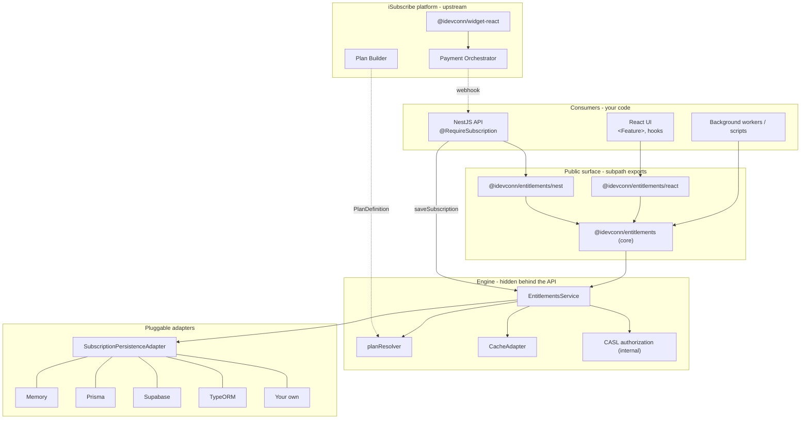

# `@idevconn/entitlements`

> The runtime engine that turns purchased subscription plans into real feature
> access across your product — boolean gates, numeric limits, metered usage —
> through one tiny API used from React, NestJS, or any Node service.

[](#compatibility)
[](./LICENSE)
[](./tsconfig.base.json)

---

## Why this exists

Every SaaS app eventually has to answer the same question, in **a thousand
different places**:

> "_Is this user allowed to do this thing right now, and if so, how much of
> it can they do?_"

The iSubscribe platform already covers the rest of the subscription lifecycle:

- **Plan Builder** — author plans (which features, which limits, which
  metered budgets).
- **`@idevconn/widget-react`** — render plans, collect the customer's pick.
- **Payment Orchestrator** — process checkout via Stripe / Paddle / PayPal /
  custom.

What was missing was the connective tissue between **"user paid"** and
**"user can"**. Without it, every team writes their own ad-hoc gates, leaks
CASL or feature-flag SDKs into their product code, double-counts metered
usage, and disagrees on whether `403` or `402` means "no subscription".

`@idevconn/entitlements` is that missing piece, distilled into one package
with a deliberately small surface.

---

## What you get

- A single, business-shaped service:
  `has`, `require`, `limit`, `usage`, `check`, `consume`, `getPlan`,
  `getSubscription`, `getEntitlements`.
- Three integration surfaces from one npm install:
  - **Core** for any Node service.
  - **`/react`** — `<EntitlementsProvider>`, `<Feature>`, `<LockedFeature>`,
    `useFeature`, `useLimit`, `useUsage`, `useSubscription`. SSR-friendly.
  - **`/nest`** — `EntitlementsModule`, `@RequireSubscription(...)`,
    `EntitlementsGuard`, `ConsumeOnSuccessInterceptor`.
- Pluggable persistence: built-in adapters for **Prisma**, **Supabase**,
  **TypeORM**, and **Memory** (tests/demos), or implement the 5-method
  interface yourself.
- CASL is hidden behind the public API — your product code never imports it.
- Strict TypeScript, dual ESM/CJS, tree-shakable, multi-tenant ready, cache
  built in, integration-tested Nest guard suite, Apache-2.0.

---

## Architecture at a glance



Read the diagram top-to-bottom: your code (Nest/React/Worker) only ever
touches the **public surface**. The **engine** does the work, delegating
storage to a **persistence adapter** of your choice. **Plan Builder**,
**Widget** and **Payment Orchestrator** sit upstream — this package is the
runtime view of the subscriptions they produce.

A deeper diagram set (request lifecycle, consume lifecycle, end-to-end
purchase flow, multi-tenant key composition) lives in
[`doc/guide.md`](./doc/guide.md).

---

## Install

```bash
npm install @idevconn/entitlements
```

The package ships **one** publishable npm name with subpath exports. Install
peer-deps **only for the integrations you actually use**:

| You use                | Add                                                 |
| ---------------------- | --------------------------------------------------- |
| Core only              | _(nothing extra)_                                   |
| React provider / hooks | `react react-dom`                                   |
| Nest guard / decorator | `@nestjs/common @nestjs/core reflect-metadata rxjs` |
| Prisma persistence     | `@prisma/client`                                    |
| Supabase persistence   | `@supabase/supabase-js`                             |
| TypeORM persistence    | `typeorm`                                           |

A frontend-only consumer never sees NestJS in their bundle. A backend-only
consumer never ships React. `sideEffects: false` + dual ESM/CJS keep this
honest.

---

## Quickstart — 5 minutes

Three lines that cover 90% of usage:

```ts
import { createEntitlements } from '@idevconn/entitlements';
import { createMemoryAdapter } from '@idevconn/entitlements/adapters/persistence/memory';

const entitlements = createEntitlements({
  persistence: createMemoryAdapter(),
  planResolver: async (id) => PLANS[id] ?? null,
  fallbackPlan: PLANS.free
});

// 1. After a successful checkout (call this from your webhook handler):
await entitlements.saveSubscription(activeSubscriptionFromOrchestrator);

// 2. Anywhere in your code:
const svc = entitlements.for({ userId });
if (await svc.has('crm.export')) {
  /* render the button */
}
await svc.consume('ai.tokens.monthly', 2_500); // metered burn
```

That is the whole consumer model. The React provider and NestJS guard are
thin adapters on top of this same service.

For the full step-by-step (Nest, React, raw Node, SSR, multi-tenant,
configuration knobs) see [`doc/guide.md`](./doc/guide.md).

---

## Main entry points

| Import                                                 | What it gives you                                                                                                                                                                                 |
| ------------------------------------------------------ | ------------------------------------------------------------------------------------------------------------------------------------------------------------------------------------------------- |
| `@idevconn/entitlements`                               | `createEntitlements`, `EntitlementsService`, all types and error classes                                                                                                                          |
| `@idevconn/entitlements/react`                         | `<EntitlementsProvider>`, `<Feature>`, `<LockedFeature>`, `useSubscription`, `useFeature`, `useLimit`, `useUsage`                                                                                 |
| `@idevconn/entitlements/nest`                          | `EntitlementsModule`, `@RequireSubscription`, `EntitlementsGuard`, `ConsumeOnSuccessInterceptor`, `defaultEntitlementsContextResolver`, `unsafeHeaderBasedEntitlementsContextResolver`, DI tokens |
| `@idevconn/entitlements/adapters/persistence/memory`   | `createMemoryAdapter` — single-process, for tests/demos                                                                                                                                           |
| `@idevconn/entitlements/adapters/persistence/prisma`   | `createPrismaAdapter` — atomic counters via `update increment`                                                                                                                                    |
| `@idevconn/entitlements/adapters/persistence/supabase` | `createSupabaseAdapter` — atomic counters via Postgres RPC                                                                                                                                        |
| `@idevconn/entitlements/adapters/persistence/typeorm`  | `createTypeOrmAdapter` — atomic counters via `Repository.increment`                                                                                                                               |

### NestJS identity and security

The **default** context resolver never reads `x-user-id` / `x-tenant-id`. Identity
must come from `req.user` (after your auth guard) or `req.entitlementsContext`.

The runnable example API passes `unsafeHeaderBasedEntitlementsContextResolver`
only so `curl` recipes work without JWT wiring — never copy that into production.

---

## Documentation map

This README is the reception desk. Open the right door for the job:

| Door                                               | When to open it                                                                                                                      |
| -------------------------------------------------- | ------------------------------------------------------------------------------------------------------------------------------------ |
| [`doc/guide.md`](./doc/guide.md)                   | **Start here.** Consumer guide — install, configure, gate UI/APIs, consume metered features. Diagrams + recipes for Nest/React/Node. |
| [`doc/design.md`](./doc/design.md)                 | Why this module exists, what problem it solves, design rationale. Written for product owners and architects. No code.                |
| [`doc/test.md`](./doc/test.md)                     | Five levels of validation: unit tests, live `curl` walkthroughs, React UI, packaged tarball install, Docker.                         |
| [`ARCHITECTURE.md`](./ARCHITECTURE.md)             | Source-level layout, file-by-file responsibilities, persistence schema templates. For contributors.                                  |
| [`apps/example-nest-api`](./apps/example-nest-api) | Runnable NestJS reference: guard, decorator, interceptor, admin upsert, `/me` and `/me/usage/:metric` diagnostic routes.             |
| [`apps/example-react`](./apps/example-react)       | Runnable Vite + React reference: provider, hooks, components, reactive metered consume.                                              |

---

## Public API at a glance

### `createEntitlements(config)`

```ts
createEntitlements({
  persistence, // required — SubscriptionPersistenceAdapter
  planResolver, // required — (planId) => Promise<PlanDefinition | null>
  fallbackPlan, // optional — what anonymous / free users get
  authorization, // optional — defaults to CaslAuthorizationEngine
  cache, // optional — defaults to MemoryCache (5s TTL)
  cacheTtlMs: 5_000, // optional — 0 disables caching
  logger // optional — { debug, info, warn, error }
});
```

### `EntitlementsService`

```ts
has(feature): Promise<boolean>;
require(feature): Promise<void>;                  // throws EntitlementDeniedError
limit(feature): Promise<number | null>;
usage(feature): Promise<number>;
check(feature, amount?): Promise<boolean>;        // would consume succeed?
consume(feature, amount?): Promise<void>;         // burns or throws
getPlan(): Promise<ActivePlan>;
getSubscription(): Promise<ActiveSubscription>;
getEntitlements(): Promise<Record<string, FeatureValue>>;
```

### Errors and HTTP mapping

| Class                       | `code`                   | HTTP | When                                             |
| --------------------------- | ------------------------ | ---- | ------------------------------------------------ |
| `NoActiveSubscriptionError` | `NO_ACTIVE_SUBSCRIPTION` | 402  | no subscription record and no `fallbackPlan`     |
| `EntitlementDeniedError`    | `ENTITLEMENT_DENIED`     | 403  | feature is `false` or undeclared on current plan |
| `LimitExceededError`        | `LIMIT_EXCEEDED`         | 403  | metered feature would go over limit              |
| `UnknownFeatureError`       | `UNKNOWN_FEATURE`        | 400  | feature key not declared on plan (strict mode)   |
| `InvalidInputError`         | `INVALID_INPUT`          | 400  | bad config / negative amount / etc.              |
| `PlanNotFoundError`         | `PLAN_NOT_FOUND`         | 500  | resolver returned `null` for an active plan id   |

The NestJS guard maps these to the right `HttpException` automatically — see
[`packages/entitlements/src/nest/entitlements.guard.ts`](./packages/entitlements/src/nest/entitlements.guard.ts).

---

## Try it locally

```bash
npm install
npm run start:dev:nest    # http://localhost:3000  (NestJS demo)
npm run start:dev:react   # http://localhost:5173  (React demo)
```

Then walk through the recipes in [`doc/test.md`](./doc/test.md). Every
documented `curl` snippet is verified against the live server, including the
`/me/usage/:metric` counter, the `bob` exhaustion path that proves
`LIMIT_EXCEEDED`, and the `stranger` 403 that proves the fallback plan.

For Docker:

```bash
cp apps/example-nest-api/.env.example apps/example-nest-api/.env
docker compose up --build
```

---

## Compatibility

- **Node** ≥ 20 (LTS). CI runs on 24.
- **TypeScript** ≥ 5.4 recommended (strict, `exactOptionalPropertyTypes`).
- **React** 18 or 19 (peer, optional).
- **NestJS** 10 or 11 (peer, optional).
- **Prisma** 5/6, **Supabase** 2, **TypeORM** 0.3 (each peer, each optional).

---

## Repo layout

```
isubscribe-entitlements/
  packages/entitlements/        # the only publishable package
  apps/example-nest-api/        # runnable NestJS reference
  apps/example-react/           # runnable Vite + React reference
  doc/{guide,design,test}.md    # consumer guide, design rationale, test recipes
  ARCHITECTURE.md               # source-level architecture
  Dockerfile + docker-compose.yml
  .github/workflows/ci.yml      # CI + release
  .github/workflows/publish.yml # npm publish
```

Two GitHub Actions workflows handle the full pipeline:

**[`ci.yml`](.github/workflows/ci.yml)** — runs on every push to `main` and on all pull requests:

1. **ci** — lint, format check, build, typecheck, test coverage (Node 24)
2. **release** — bumps `package.json` version from conventional commit messages, tags, and creates a GitHub Release (main branch only, runs after `ci` passes)

**[`publish.yml`](.github/workflows/publish.yml)** — publishes to npm, triggered by `v*` tags, a published GitHub Release, or manually:

- Builds the package, checks if the version is already on npm, then publishes with provenance via `NPM_TOKEN`.

Requires a `NPM_TOKEN` repository secret for publishing.

---

## Contributing

Contributions and bug reports are welcome. Please run the full pipeline
locally before opening a PR:

```bash
npm run lint && npm run format:check && npm run typecheck && npm run test && npm run build
```

The pre-commit hook runs lint-staged on staged files; the CI pipeline runs the full suite on every push.

---

## License

Apache-2.0 — see [`LICENSE`](./LICENSE).
