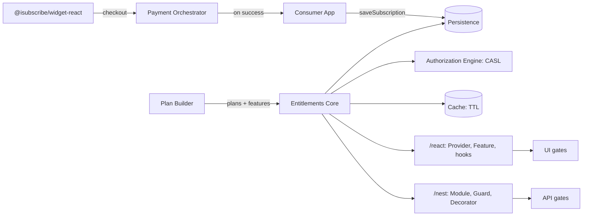
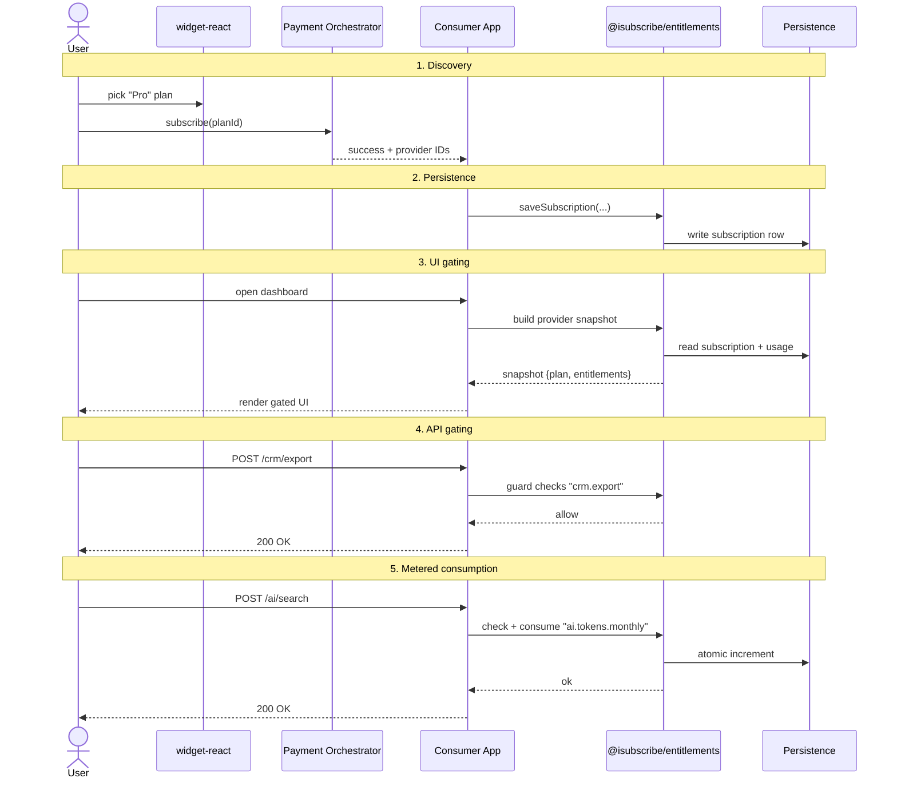
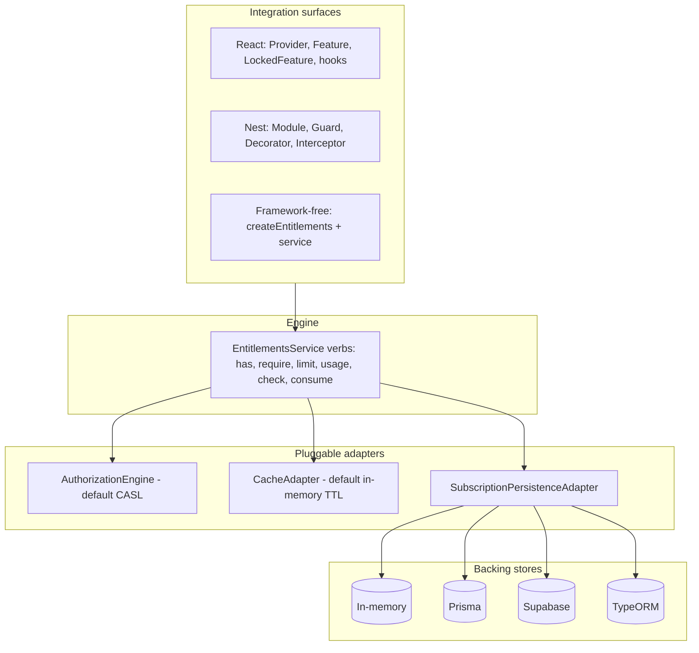

# Design — `@isubscribe/entitlements`

A high-level design overview written for product owners, architects, and new
engineers joining the iSubscribe platform. It explains **why this module
exists**, **what problem it solves**, and **how the pieces fit together** —
without diving into source code. For implementation details see
[`ARCHITECTURE.md`](../ARCHITECTURE.md); for usage see
[`README.md`](../README.md).

---

## 1. Intention

`@isubscribe/entitlements` is the **runtime authority** that answers a single
question across an entire product: _"is this user allowed to do this thing
right now, and if so, how much of it can they do?"_

Around it sit three siblings on the iSubscribe platform:

- **Plan Builder** — where humans author what plans look like (which features
  are on, which are off, which have numeric caps, which are metered).
- **Widget for React** — where customers see those plans and pick one.
- **Payment Orchestrator** — where money changes hands and a subscription is
  created with one of the supported providers (Stripe, Paddle, PayPal, etc.).

After the cash register closes, somebody has to translate "the user just
bought the Pro plan" into thousands of small runtime decisions: should the
"Export CRM" button render? Should the `POST /reports/advanced` endpoint
accept the request? Are there enough AI tokens left this month to run that
search?

That translation work is what this module owns.

---

## 2. Problem statement

The platform already solves the lifecycle of a subscription end-to-end —
**except** for the connective tissue between "purchased" and "enforced". Every
consumer application that adopts iSubscribe currently has to reinvent the
following on its own:

1. **Loading the active subscription** for the user making the request.
2. **Resolving plan features** so the app knows what "Pro" actually grants today.
3. **Evaluating boolean access** ("can the user export CRM data?").
4. **Evaluating numeric limits** ("how many projects are they allowed to
   create?").
5. **Tracking metered usage** ("how many AI tokens have they spent this billing
   period, and is the next request affordable?").
6. **Wiring the answers into UI gates** so disallowed buttons disappear or show
   an upgrade prompt.
7. **Wiring the answers into API gates** so disallowed endpoints reject the
   request before any business logic runs.
8. **Doing all of the above safely**: with concurrent-safe usage counters,
   per-tenant isolation, sensible caching, and fallbacks for users who don't
   yet have a subscription.

In practice, every team reaches for an authorization library (most often CASL),
ad-hoc database queries, and a handful of ad-hoc React/HOCs/middlewares. The
result is duplicated, subtly inconsistent, and hard to evolve. CASL also leaks
through public surfaces, which couples application code to a specific
authorization engine.

We need **one module** that hides those concerns behind a small,
business-oriented API, ships React and NestJS integrations, and lets product
teams stop thinking about the plumbing.

---

## 3. Solution at a glance

`@isubscribe/entitlements` is a single npm package with three integration
surfaces:

- A **framework-agnostic core** that builds an `EntitlementsService` per user.
- A **React surface** (`/react`) for UI gating.
- A **NestJS surface** (`/nest`) for API gating.

Internally it is built around three pluggable contracts:

- A **persistence adapter** (where the subscription and usage rows live).
- An **authorization engine** (how feature rules are compiled and evaluated).
- A **cache adapter** (how compiled rules are reused within a request window).

The default authorization engine is built on top of **CASL**, but consumers
never see CASL types — that detail is intentionally encapsulated so it can be
swapped (for OPA, Cerbos, or a hand-rolled evaluator) without breaking any
public API.

---

## 4. Goals and non-goals

### Goals

- Provide a small, **business-oriented vocabulary**: _has, require, limit,
  usage, check, consume_. Anyone reading the code should immediately understand
  what an endpoint or component is enforcing.
- Hide the authorization engine. Application code never imports CASL.
- Be **framework-agnostic at the core** and ship first-class adapters for the
  two frameworks the platform standardises on (React + NestJS).
- Stay **multi-tenant by design**: every read and write is scoped by user and
  optional tenant.
- Be **SSR-safe**: the React provider works equally well when the snapshot is
  produced on the server.
- Be **tree-shakable** and **integration-agnostic**: a backend-only consumer
  must not pay React's bundle cost, and a React consumer must not pull in
  NestJS.
- Provide concurrency-safe **metered usage**: counters never race, even under
  parallel requests.
- Provide a **fallback plan** so anonymous or free-tier users still get a
  consistent answer instead of a hard error.
- Mirror the operational shape of the existing `@idevconn/payment` package
  (workspaces, tsup, semantic-release, multi-stage Docker, Node 22/24 CI) so
  that anyone who has worked on Payment Orchestrator feels at home.

### Non-goals

- This module does **not** charge cards. It only consumes the
  `ActiveSubscription` shape produced after a successful checkout.
- It does **not** receive provider webhooks. The consumer app (or a future
  orchestrator integration) translates webhook events into `saveSubscription`
  calls.
- It does **not** own the database schema. Consumers bring their own database
  and pick a persistence adapter.
- It does **not** ship UI for upgrade flows. `LockedFeature` lets you slot in
  whatever upsell component your design system already provides.
- It does **not** provide reporting or analytics. Usage counters are the
  source of truth for enforcement; downstream reporting belongs in a
  separate pipeline.

---

## 5. The data model in plain words

Three concepts make up the entire vocabulary.

### Plan definition

An author-time description of a plan. Owned by Plan Builder. Identified by
a stable `id`. The body is a map from **feature name** to **feature value**:

- A boolean value gates a capability on or off (for example, "CRM export is
  on for Pro").
- A numeric value declares a cap (for example, "Pro allows up to 10
  projects").
- A null value means "this is allowed and unmetered" (for example, "Pro has
  unlimited storage").
- The plan can list a subset of feature names as **metered**, marking
  numeric values that are consumed over the period rather than treated as a
  hard cap.

### Active subscription

The runtime record that says: this user is on this plan right now. Owned by
the consumer application's database. Beyond identity (`userId`, optional
`tenantId`, `planId`) it carries:

- A **lifecycle status** — only `trialing` and `active` grant entitlements;
  anything else falls back to the optional fallback plan or to "deny by
  default".
- The **provider context** — which payment provider issued it, and the
  provider's customer/subscription ids (handy for support flows).
- The **billing period boundaries** — used to scope metered counters so they
  reset automatically when a period rolls over.
- A **snapshot of effective entitlements** — used as a graceful fallback if
  the live plan resolver cannot find the plan id (for example, the plan was
  renamed after the user subscribed).

### Entitlements context

The simplest concept: who is asking? A `userId` and optional `tenantId` that
scope every read and write. A request with no resolvable context never reaches
the engine — it is rejected at the integration layer (the Nest guard returns
401, the React provider raises a developer-facing error if used outside a
provider).

---

## 6. The runtime contract (`EntitlementsService`)

Every integration surface boils down to one tiny service per context. The
public verbs map directly to product questions:

| Verb                                            | Reads as                                                             |
| ----------------------------------------------- | -------------------------------------------------------------------- |
| `has`                                           | _Is this feature granted?_                                           |
| `require`                                       | _Throw if it isn't (used by guards, route handlers)._                |
| `limit`                                         | _What's the cap? Could be a number, "unlimited", or "not declared"._ |
| `usage`                                         | _How much of the current period have they spent?_                    |
| `check`                                         | _Could a proposed amount fit within the remaining budget?_           |
| `consume`                                       | _Charge that amount against the budget, atomically._                 |
| `getPlan`, `getSubscription`, `getEntitlements` | _Read the resolved state._                                           |

There are no other verbs. There never should be. New use cases should compose
these primitives, not add new ones.

---

## 7. End-to-end lifecycle

A typical user journey involves five distinct moments. Each one talks to the
module through a different surface, but they all converge on the same
`EntitlementsService`.

Two important design choices show up here:

- The package draws a hard line between "the orchestrator told us a payment
  succeeded" and "we have a subscription record". The application is the one
  that actually persists the record. We don't reach into the orchestrator's
  storage and we don't subscribe to its webhooks. This keeps responsibilities
  unambiguous.
- Metered consumption is split into two verbs: `check` (read-only, cheap, used
  by the guard before the handler runs) and `consume` (mutating, called only
  when the handler succeeds). The Nest interceptor wires this together so a
  failed request never burns quota.

---

## 8. Layered design

- **Surfaces** are framework adapters. They are deliberately thin: they pull
  the request context, delegate to the service, and translate engine errors
  into framework errors (HTTP status codes for Nest, render fallbacks for
  React).
- **The engine** is one class. It compiles rules once per resolved state and
  caches them inside the configured cache adapter. It never talks to a
  database directly.
- **Adapters** are interfaces with default implementations. Each can be
  replaced without touching the engine or the surfaces.
- **Backing stores** are owned by the consumer. The package ships four
  adapter implementations and recommended schemas; consumers who want a
  different store implement the adapter contract.

---

## 9. Authorization engine: how CASL is hidden

CASL is excellent at composing rules, but it is also a public type system that
tends to leak into application code (subjects, abilities, conditions, etc.).
The package treats CASL as an **internal evaluator**, not a public dependency.

The mapping from a plan feature map to compiled rules is intentionally narrow:

- `boolean true` and `null` (unlimited) become "the user can access this
  feature".
- `number > 0` also becomes "can access", and additionally exposes the number
  as a numeric limit.
- `boolean false` and `number === 0` produce no rule, so they are denied by
  default.
- Undeclared features are denied by default. There is no implicit "everyone
  has it" mode.

A subscription whose status is anything other than `trialing` or `active`
compiles to an empty rule set. If a fallback plan is configured (typically a
"free tier"), the engine falls back to it for those users; otherwise every
feature is denied. This makes the module's behavior predictable across the
entire status lifecycle without leaking the concept of "status" into the
public API.

The authorization engine is exposed as an interface. Replacing it with
something like Cerbos or OPA is a single-class change with no consumer
impact. CASL stays an implementation detail, even when CASL is the engine in
use.

---

## 10. Persistence and metered counters

Every shipped persistence adapter implements the same five operations: read
the subscription, write the subscription, read a usage counter, increment a
usage counter atomically, and (optionally) reset a counter.

Two design choices deserve highlighting:

- **Atomic increments.** Metered consumption can be triggered by parallel
  requests for the same user. Adapters always issue an atomic database
  operation (Prisma's `update { increment }`, TypeORM's `Repository.increment`,
  a Postgres function for Supabase, an in-process Map mutation for memory).
  The engine never reads-then-writes, so two concurrent `consume` calls
  cannot lose updates.
- **Period-scoped counters.** Each row is keyed by user, tenant, metric, and
  the **billing period start** (taken from the active subscription by
  default). When a new period rolls over, the engine starts hitting fresh
  rows; old counters remain in the database for audit purposes. Operators who
  want to free that space can attach a periodic reset job — but day-to-day
  the system "forgets" old usage automatically.

---

## 11. Caching and freshness

A naive entitlements check would touch the database twice on every request
(read the subscription, read each usage counter). That is too expensive for
hot paths, and unnecessary because the resolved rules are stable for the
duration of a request and almost always the duration of several seconds.

The default cache adapter is a process-local TTL store (5 seconds). It
caches the **resolved state** — subscription plus compiled rules — keyed by
user (and tenant). On every `consume` call the cache entry is invalidated so
the next read of `usage` sees fresh data. On every `saveSubscription` call
the corresponding cache entry is invalidated, so a webhook handler that
upgrades a user takes effect on the very next request.

The cache adapter is pluggable, so multi-instance deployments can swap in
Redis without touching the engine. Setting the TTL to zero disables caching
entirely for environments that prefer to read through every time.

---

## 12. SSR and the React surface

The React surface is built around a single context that holds a snapshot:
status (`idle`, `loading`, `ready`, `error`), the active subscription, the
resolved plan, the entitlements map, and any error.

- On the **server**, the application can build a service per request,
  resolve the snapshot ahead of time, and pass it to the provider as
  `initialSnapshot`. The provider then skips its initial fetch and renders
  with the snapshot verbatim. This makes the package compatible with Next.js
  App Router, Remix, SvelteKit's React islands, and other SSR setups.
- On the **client**, the provider hydrates the snapshot, listens for
  invalidation events triggered by `consume`, and re-fetches automatically.
- All four hooks (`useSubscription`, `useFeature`, `useLimit`, `useUsage`)
  are reactive: they re-render their consumers whenever the snapshot changes
  in response to a write.

There are no top-level browser globals in the React surface. The package can
be statically rendered on Node without polyfills.

---

## 13. NestJS surface

The NestJS surface is intentionally small:

- A module that registers the entitlements handle, a context resolver, and
  the global guard.
- A decorator (`@RequireSubscription`) that attaches metadata to a route
  handler.
- A guard that reads that metadata, resolves the request's user/tenant
  context, and calls the engine. Engine errors become typed Nest exceptions
  (`ForbiddenException` for denials and limit violations,
  `PaymentRequiredException` when no active subscription exists at all).
- An optional interceptor that consumes metered budget only after a
  successful response, so a failed handler never burns quota.

The context resolver is pluggable. The default reads the user id from
`req.user`, common JWT claim shapes, or `x-user-id` / `x-tenant-id` headers
(useful in development and end-to-end tests). Real applications can replace
it with one line, plugging in Passport, Clerk, Auth0, or whatever auth
strategy is in use.

---

## 14. Multi-tenancy

Every public read and write carries a context with an optional `tenantId`.
The shipped adapters store `tenantId` alongside `userId` in their composite
keys, so a single user belonging to multiple workspaces gets independent
subscriptions, independent counters, and independent cache entries — without
any extra wiring at the application layer.

For applications that don't have tenants, the field is simply omitted; the
adapter keys remain stable.

---

## 15. Failure modes and how they're surfaced

Every internal error extends a single `EntitlementsError` base class with a
typed code, an HTTP status code, and a structured response body.

| Situation                                     | Class                       | HTTP |
| --------------------------------------------- | --------------------------- | ---- |
| Boolean feature denied                        | `EntitlementDeniedError`    | 403  |
| Metered amount would exceed the period budget | `LimitExceededError`        | 403  |
| No subscription record for the context        | `NoActiveSubscriptionError` | 402  |
| Feature key is not declared on the plan       | `UnknownFeatureError`       | 400  |
| Invalid input to a parser                     | `InvalidInputError`         | 400  |
| `planResolver` returned `null`                | `PlanNotFoundError`         | 404  |

Failure responses always carry the same shape: a stable `code`, a
human-readable `message`, and a structured `details` object. Front-ends can
match on `code` to decide whether to show an upgrade card, a "no quota left"
banner, or a generic error.

---

## 16. Operational shape

The repository follows the same conventions as the existing
`@idevconn/payment` monorepo, so anyone familiar with that codebase finds
this one immediately legible:

- npm workspaces, two folders: `packages/entitlements/` (publishable) and
  `apps/` (private demos for Nest and React).
- Strict TypeScript with `exactOptionalPropertyTypes`, ESLint + Prettier,
  Husky + lint-staged, semantic-release with OIDC-based npm publishing,
  multi-stage `node:24-alpine` Docker for the Nest example, CI matrix on
  Node 22 and 24.
- Vitest for unit and integration tests with coverage thresholds enforced in
  CI.

---

## 17. Trade-offs we accepted

Every design has explicit choices. These are the ones worth calling out.

| Choice                                                               | Trade-off                                                                                                                                                                                                          |
| -------------------------------------------------------------------- | ------------------------------------------------------------------------------------------------------------------------------------------------------------------------------------------------------------------ |
| Single npm package with subpath exports instead of multiple packages | Easier to release and version, but every framework dep ends up declared in the package's `peerDependencies`. We mitigate this with `peerDependenciesMeta.optional = true` so consumers only install what they use. |
| CASL hidden behind an interface                                      | Adds a tiny indirection and an extra concept (`AuthorizationEngine`). Pays back the first time we want to swap engines, or simply A/B test a custom evaluator.                                                     |
| Period-scoped usage rows instead of a single row that resets         | More rows in the database, but no global "reset job" required for correctness, and historical usage is preserved for audit.                                                                                        |
| In-memory default cache                                              | Good enough for single-instance deploys; multi-instance setups need to opt into Redis. The interface makes that a one-config change.                                                                               |
| The package does not consume webhooks itself                         | Keeps responsibilities clean: webhooks belong to providers, this module owns enforcement. The price is one small webhook handler in the consumer app calling `saveSubscription`.                                   |

---

## 18. Future scope (explicitly out of v1)

These are deliberately not in the first cut, but are anticipated:

- A **first-party orchestrator integration** that listens to provider events
  and calls `saveSubscription` automatically.
- An **observability layer** with structured logs, metrics, and traces around
  the engine. The current `Logger` hook is the foothold.
- **Refund / cancel hooks** that downgrade a user mid-period instead of at the
  next renewal.
- A **Cerbos / OPA adapter** to validate that the engine swap actually works
  end-to-end.
- An **entitlements admin UI** for support staff to inspect a customer's
  resolved state without SSH access to the database.

---

## 19. Why this design, in one paragraph

The platform already has a great way to **author** plans, **render** them, and
**charge** for them. What it lacked was a uniform way to **enforce** them.
Without this module, every consumer app reinvents authorization plumbing on
top of CASL or hand-rolled rules, ends up coupled to a specific engine, and
diverges over time. With this module, the entire platform speaks a single
sentence — _"is this feature granted, and is there budget for it?"_ — and any
team that already knows the Payment Orchestrator instantly knows where things
live in the entitlements module, because the operational shape is the same.
