# Consumer Guide — `@idevconn/entitlements`

A practical, end-to-end guide for application engineers integrating
`@idevconn/entitlements` into their product. It answers two questions:

1. **How do I use it?** — install, configure, gate UI and APIs, observe usage.
2. **How does it work?** — what every call does under the hood, where state
   lives, how the pieces wire together, what dependencies you actually pull in.

For the conceptual story see [`design.md`](./design.md). For test/validation
recipes see [`test.md`](./test.md). For source layout see
[`../ARCHITECTURE.md`](../ARCHITECTURE.md).

---

## 1. TL;DR

```ts
const entitlements = createEntitlements({ persistence, planResolver, fallbackPlan });

// after a successful checkout
await entitlements.saveSubscription(activeSubscription);

// somewhere deep in your code
const svc = entitlements.for({ userId });
if (await svc.has('crm.export')) {
  /* render the button */
}
await svc.consume('ai.tokens.monthly', 2_500); // metered burn
```

Three concepts you ever touch:

- **`createEntitlements`** — top-level factory.
- **`entitlements.for({ userId })`** — get a per-user service.
- **`service.has / require / limit / usage / check / consume`** — make decisions.

That is the whole consumer surface. The React provider, NestJS guard and CASL
all sit behind it.

---

## 2. Where this package sits in the iSubscribe platform

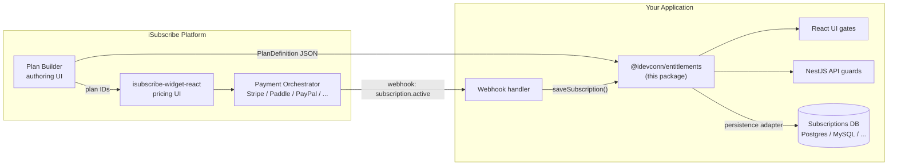

**Plan Builder** authors `PlanDefinition`s. **Widget** renders them and routes
to **Payment Orchestrator**. After a successful checkout, your webhook calls
`entitlements.saveSubscription(...)` and the same module is then consulted by
your React UI and NestJS API to decide what each user can do.

This package is the _bridge_ between "user paid" and "user can".

---

## 3. Package architecture & dependencies

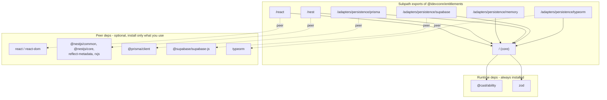

### What you actually install

```bash
npm install @idevconn/entitlements
```

That brings in only `@casl/ability` and `zod`. Everything else is **optional
peer**: pull only the framework/persistence you actually use.

| You use                | Add                                                 |
| ---------------------- | --------------------------------------------------- |
| Just the engine (Node) | nothing extra                                       |
| React UI               | `react react-dom`                                   |
| NestJS API             | `@nestjs/common @nestjs/core reflect-metadata rxjs` |
| Prisma persistence     | `@prisma/client`                                    |
| Supabase persistence   | `@supabase/supabase-js`                             |
| TypeORM persistence    | `typeorm`                                           |

A frontend-only consumer never sees NestJS in their bundle. A backend-only
consumer never ships React. Tree-shaking + `sideEffects: false` keep this
honest.

---

## 4. The three things you must provide

Whatever stack you use, `createEntitlements` always needs three inputs:

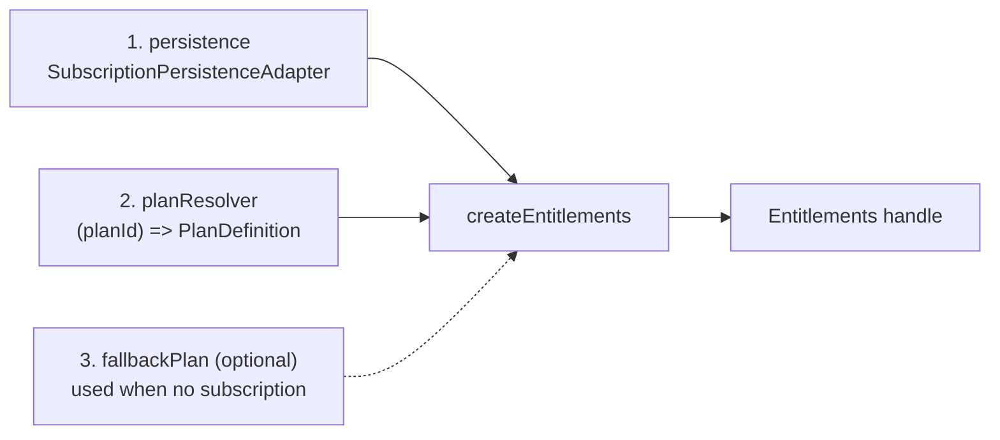

- **persistence** — where active subscriptions and metered counters live. Pick
  a built-in adapter (`memory` / `prisma` / `supabase` / `typeorm`) or
  implement [`SubscriptionPersistenceAdapter`](../packages/entitlements/src/adapters/persistence/interface.ts) yourself.
- **planResolver** — function `(planId) => PlanDefinition | null`. Plans usually
  live in the same place as the Plan Builder; the resolver is your read-side.
- **fallbackPlan** _(optional)_ — what an anonymous user / free-tier user
  gets when no subscription is found. Without it, missing subscription = 402.

That is **all** the configuration. Cache, authorization engine and logger have
sensible defaults (`MemoryCache` with 5 s TTL, `CaslAuthorizationEngine`, no-op
logger) — see [`create-entitlements.ts`](../packages/entitlements/src/core/create-entitlements.ts).

---

## 5. The three feature types

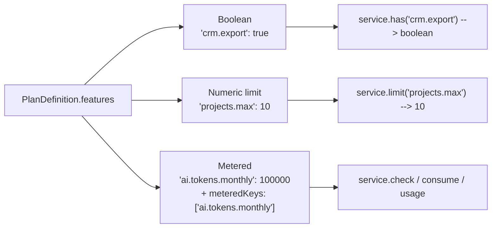

| Type          | Plan shape                                                            | API                                     |
| ------------- | --------------------------------------------------------------------- | --------------------------------------- |
| Boolean       | `'crm.export': true \| false`                                         | `has()`, `require()`                    |
| Numeric limit | `'projects.max': 10`                                                  | `limit()` (read), `has()` (granted/not) |
| Unlimited     | `'storage.gb': null`                                                  | `limit()` returns `null`                |
| Metered       | `'ai.tokens.monthly': 100_000` + `meteredKeys: ['ai.tokens.monthly']` | `check()`, `consume()`, `usage()`       |

Metered features are numeric limits **plus** a counter — listing them in
`meteredKeys` tells the engine "deduct from this, do not just compare".

---

## 6. Runtime: what happens when you call `service.has(...)`

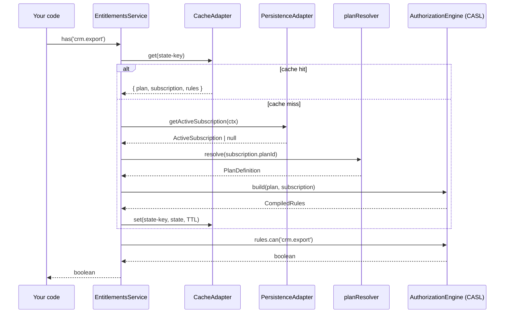

So a single `has()` call costs **one cache lookup** in steady state and **one
DB read + one plan-resolver call + one CASL compile** on a cold context. After
that the resolved state is cached for `cacheTtlMs` (default 5 s).

`require()` does the same and throws `EntitlementDeniedError` (or
`NoActiveSubscriptionError` if there is no subscription and no fallback).

---

## 7. Runtime: what happens when you call `service.consume(...)`

```mermaid
sequenceDiagram
    participant App as Your code
    participant Svc as EntitlementsService
    participant Persist as PersistenceAdapter
    participant Cache as CacheAdapter

    App->>Svc: consume('ai.tokens.monthly', 2500)
    Svc->>Svc: resolve() (sequence above)
    Svc->>Svc: rules.can(feature)?
    alt denied
        Svc-->>App: throws EntitlementDeniedError
    end
    Svc->>Persist: getUsage(ctx, feature)
    Persist-->>Svc: used
    Svc->>Svc: used + amount &lt;= limit?
    alt over limit
        Svc-->>App: throws LimitExceededError (402-style)
    end
    Svc->>Persist: incrementUsage(ctx, feature, amount)
    Svc->>Cache: delete(state-key)
    Svc-->>App: ok
```

Two important properties:

1. **Atomicity** is delegated to the adapter. The Prisma/Supabase/TypeORM
   adapters use database-level atomic increments (`UPDATE ... SET used = used + ?`,
   Postgres RPC, `Repository.increment`). The memory adapter is single-process.
2. **Cache invalidation** happens automatically after `consume()` so the next
   `has()` / `usage()` reads the fresh number.

---

## 8. Quickstart — backend (NestJS)

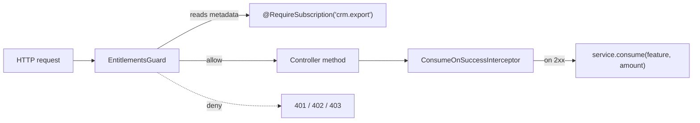

```ts
// app.module.ts
import { Module } from '@nestjs/common';
import { EntitlementsModule } from '@idevconn/entitlements/nest';
import { createMemoryAdapter } from '@idevconn/entitlements/adapters/persistence/memory';
import { PLANS, planResolver } from './plans';

@Module({
  imports: [
    EntitlementsModule.forRoot({
      config: {
        persistence: createMemoryAdapter(),
        planResolver,
        fallbackPlan: PLANS.free
      },
      isGlobal: true
    })
  ],
  controllers: [CrmController]
})
export class AppModule {}
```

```ts
// crm.controller.ts
import { Controller, Get } from '@nestjs/common';
import { RequireSubscription } from '@idevconn/entitlements/nest';

@Controller()
export class CrmController {
  @Get('/crm/export')
  @RequireSubscription('crm.export')
  exportCrm() {
    return { exported: true };
  }

  @Get('/ai/search')
  @RequireSubscription({ feature: 'ai.tokens.monthly', amount: 1 })
  aiSearch() {
    return { ok: true, consumed: 1 };
  }
}
```

```ts
// main.ts — wire the optional ConsumeOnSuccessInterceptor
import { Reflector } from '@nestjs/core';
import {
  ConsumeOnSuccessInterceptor,
  ENTITLEMENTS,
  ENTITLEMENTS_CONTEXT_RESOLVER
} from '@idevconn/entitlements/nest';

const reflector = app.get(Reflector);
const handle = app.get(ENTITLEMENTS);
const resolver = app.get(ENTITLEMENTS_CONTEXT_RESOLVER);
app.useGlobalInterceptors(new ConsumeOnSuccessInterceptor(reflector, handle, resolver));
```

**Status codes you get for free:**

| Situation                                           | HTTP                           |
| --------------------------------------------------- | ------------------------------ |
| no authenticated identity (resolver returns `null`) | 401                            |
| no active subscription **and** no fallback plan     | 402                            |
| feature explicitly denied by current plan           | 403                            |
| metered feature over limit                          | 403 with `LIMIT_EXCEEDED` body |

The **default** context resolver uses only `req.user` (after your auth guard)
and optional `req.entitlementsContext`. It never trusts `x-user-id` /
`x-tenant-id`, because clients can forge those. For local `curl` demos and
tests you may pass `unsafeHeaderBasedEntitlementsContextResolver` explicitly on
`EntitlementsModule.forRoot({ contextResolver: ... })` — never in production.
Replace with your own resolver if you need a different shape than `req.user`.

See [`apps/example-nest-api`](../apps/example-nest-api) for the full
reference implementation.

---

## 9. Quickstart — frontend (React)

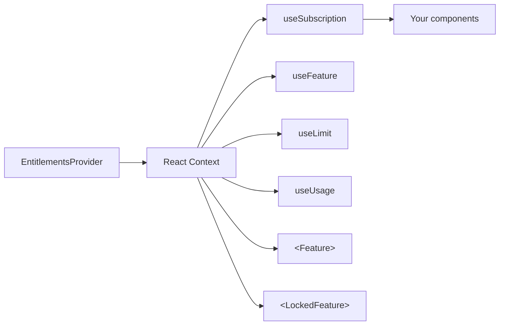

```tsx
// main.tsx
import { EntitlementsProvider } from '@idevconn/entitlements/react';
import { createMemoryAdapter } from '@idevconn/entitlements/adapters/persistence/memory';

const config = {
  persistence: createMemoryAdapter({ subscriptions: seededFromServer }),
  planResolver: async (id) => PLANS[id] ?? null,
  fallbackPlan: PLANS.free
};

createRoot(document.getElementById('root')!).render(
  <EntitlementsProvider config={config} context={{ userId: 'demo' }}>
    <App />
  </EntitlementsProvider>
);
```

```tsx
// App.tsx
import {
  Feature,
  LockedFeature,
  useFeature,
  useLimit,
  useUsage,
  useSubscription
} from '@idevconn/entitlements/react';

export function App() {
  const { allowed } = useFeature('crm.export');
  const { limit } = useLimit('projects.max');
  const { used, limit: tokenLimit } = useUsage('ai.tokens.monthly');
  const sub = useSubscription();

  return (
    <>
      <Feature name="crm.export">
        <button>Export CRM data</button>
      </Feature>

      <LockedFeature name="advanced.analytics" fallback={<UpgradeCard />}>
        <AnalyticsDashboard />
      </LockedFeature>

      <p>Up to {limit} projects.</p>
      <p>
        {used} / {tokenLimit} tokens.
      </p>

      <button onClick={() => sub.consume('ai.tokens.monthly', 2500)}>Consume 2,500 tokens</button>
    </>
  );
}
```

### SSR

When rendering on the server, build a snapshot once and pass it in:

```tsx
const snapshot = await buildSnapshotForUser(userId); // your loader
<EntitlementsProvider initialSnapshot={snapshot} config={config} context={{ userId }}>
```

The provider hydrates from the snapshot, so the first paint matches what the
server rendered. Hooks then refresh in the background. No double-fetch.

See [`apps/example-react`](../apps/example-react) for the full reference.

---

## 10. Quickstart — framework-agnostic (raw Node)

```ts
import { createEntitlements } from '@idevconn/entitlements';
import { createMemoryAdapter } from '@idevconn/entitlements/adapters/persistence/memory';

const entitlements = createEntitlements({
  persistence: createMemoryAdapter(),
  planResolver: async (id) => PLANS[id] ?? null
});

// 1. After a successful checkout (called from your webhook handler):
await entitlements.saveSubscription({
  userId: 'user_1',
  planId: 'pro_monthly',
  status: 'active',
  provider: 'stripe',
  startedAt: new Date(),
  currentPeriodStart: new Date(),
  currentPeriodEnd: new Date(Date.now() + 30 * 24 * 60 * 60 * 1000),
  entitlements: PLANS.pro_monthly.features
});

// 2. Anywhere in your code, get a per-user service:
const svc = entitlements.for({ userId: 'user_1' });

await svc.has('crm.export'); // boolean
await svc.require('crm.export'); // throws if denied
await svc.limit('projects.max'); // 10  | null  | undefined
await svc.check('ai.tokens.monthly', 2500); // boolean (would consume succeed?)
await svc.consume('ai.tokens.monthly', 2500); // burns or throws
await svc.usage('ai.tokens.monthly'); // 2500
await svc.getPlan(); // ActivePlan
await svc.getEntitlements(); // Record<string, FeatureValue>
```

Same API everywhere. The `/react` provider and `/nest` guard are just thin
adapters on top of this service.

---

## 11. Picking a persistence adapter

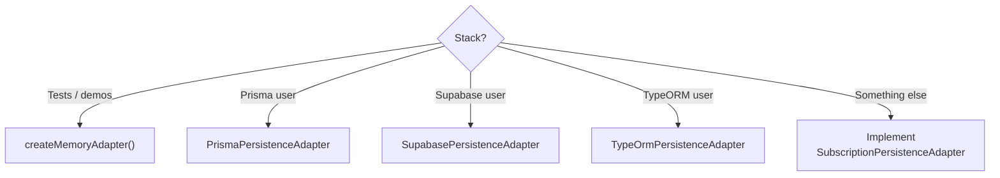

The interface ([`interface.ts`](../packages/entitlements/src/adapters/persistence/interface.ts))
is intentionally narrow:

```ts
interface SubscriptionPersistenceAdapter {
  getActiveSubscription(ctx): Promise<ActiveSubscription | null>;
  saveSubscription(sub): Promise<void>;
  getUsage(ctx, metric): Promise<number>;
  incrementUsage(ctx, metric, amount): Promise<void>;
  resetUsage(ctx, metric): Promise<void>;
}
```

Each built-in adapter:

- Memory — single-process, in-memory `Map`. Use for tests/demos only.
- Prisma — uses `upsert` + `update increment` for atomic counters.
- Supabase — uses Postgres RPC for atomic increments.
- TypeORM — uses `Repository.increment`.

A custom adapter only needs to be atomic on `incrementUsage` (read-then-write
will race at scale). Anything that supports `column = column + ?` works.

---

## 12. Caching & invalidation

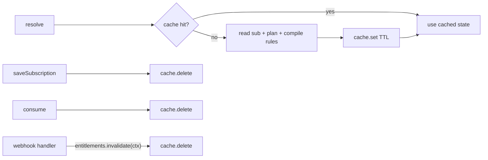

- Default cache is `MemoryCache` with 5 s TTL — fast, per-process.
- `consume()` and `saveSubscription()` invalidate automatically.
- For external invalidation (e.g. another node renewed a subscription), call
  `entitlements.invalidate(context)` from your webhook handler.
- Pluggable: pass any `CacheAdapter` to share cache across processes (Redis
  etc.). Set `cacheTtlMs: 0` to disable caching.

---

## 13. Multi-tenancy

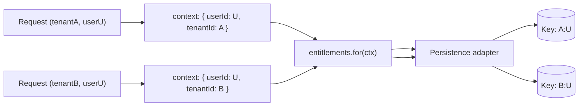

Every adapter composes a context key as `tenantId ? `${tenantId}:${userId}` : userId`.
Pass `tenantId` in the context from your auth layer; the engine treats users
in different tenants as completely separate entities, including separate
metered counters.

---

## 14. Error model

| Class                       | Code                     | HTTP | When                                                   |
| --------------------------- | ------------------------ | ---- | ------------------------------------------------------ |
| `NoActiveSubscriptionError` | `NO_ACTIVE_SUBSCRIPTION` | 402  | no subscription record and no `fallbackPlan`           |
| `EntitlementDeniedError`    | `ENTITLEMENT_DENIED`     | 403  | feature is `false` or undeclared on current plan       |
| `LimitExceededError`        | `LIMIT_EXCEEDED`         | 403  | metered feature would go over limit                    |
| `UnknownFeatureError`       | `UNKNOWN_FEATURE`        | 400  | feature key not declared on plan (when in strict mode) |
| `InvalidInputError`         | `INVALID_INPUT`          | 400  | bad config / negative amount / etc.                    |
| `PlanNotFoundError`         | `PLAN_NOT_FOUND`         | 500  | resolver returned `null` for an active plan id         |

All errors share a `toResponseBody()` shape:

```json
{ "code": "...", "message": "...", "details": { ... } }
```

The NestJS guard maps these to `HttpException` with the right status — see
[`entitlements.guard.ts`](../packages/entitlements/src/nest/entitlements.guard.ts).

---

## 15. End-to-end purchase → enforcement

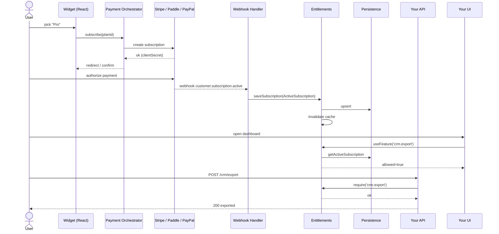

Notice the engine never talks to Stripe/Paddle/PayPal directly. It is the
_runtime view_ of state already persisted by your webhook handler — that
separation is intentional and lets each piece evolve independently.

---

## 16. Configuration knobs at a glance

```ts
createEntitlements({
  persistence, // required
  planResolver, // required
  fallbackPlan, // optional — what anonymous / free users get
  authorization, // optional — defaults to CaslAuthorizationEngine
  cache, // optional — defaults to MemoryCache
  cacheTtlMs: 5_000, // optional — 0 disables caching
  logger // optional — { debug, info, warn, error }
});
```

```ts
EntitlementsModule.forRoot({
  config, // same shape as createEntitlements
  isGlobal: true, // default false
  contextResolver // optional — defaults to secure resolver (req.user only)
});
```

```tsx
<EntitlementsProvider
  config={config}
  context={{ userId, tenantId }} // mandatory in CSR
  initialSnapshot={snapshot} // optional — for SSR hydration
  refreshIntervalMs={30_000} // optional — periodic re-resolve
/>
```

---

## 17. Common pitfalls

- **402 vs 403.** 402 means "we have no idea who paid for what" — i.e. no
  subscription record and no fallback. 403 means "we know exactly, and the
  answer is no". If you always want 403, configure a `fallbackPlan` (even an
  empty one).
- **Forgetting `meteredKeys`.** A numeric feature without `meteredKeys` is a
  cap, not a counter — `consume()` will throw `UNKNOWN_FEATURE`.
- **`consume` after the work succeeded.** `consume()` runs _before_ you do
  the actual work in the framework-agnostic API; in NestJS the
  `ConsumeOnSuccessInterceptor` flips that — it runs **after** a 2xx response.
  Pick the model that matches your "do not bill on failure" policy.
- **Cache TTL too high.** If your app cancels subscriptions out-of-band (admin
  panel, support tool), call `entitlements.invalidate(ctx)` after the change
  or lower `cacheTtlMs`.
- **Reading `service.consume` from React.** `<Feature>` and the hooks read.
  For metered burns, call `service.consume(...)` from an event handler — the
  provider auto-refreshes the snapshot afterwards.
- **Nest header spoofing.** Do not use `unsafeHeaderBasedEntitlementsContextResolver`
  in production — anyone can send `x-user-id` and impersonate another user or burn
  their metered quota. Use `defaultEntitlementsContextResolver` and populate `req.user`
  from a verified JWT/session.
- **Atomicity in custom adapters.** Implement `incrementUsage` with an atomic
  SQL `UPDATE ... SET used = used + ?` (or equivalent). Read-then-write will
  silently lose tokens at scale.

---

## 18. Where to go next

- [`design.md`](./design.md) — why this module exists, what problems it solves.
- [`test.md`](./test.md) — how to validate everything from `npm test` to a
  real `curl` against the example NestJS API.
- [`../README.md`](../README.md) — quickstart matrix and the full public API.
- [`../ARCHITECTURE.md`](../ARCHITECTURE.md) — file-level layout and module
  responsibilities.
- [`../apps/example-nest-api`](../apps/example-nest-api),
  [`../apps/example-react`](../apps/example-react) — runnable references.
